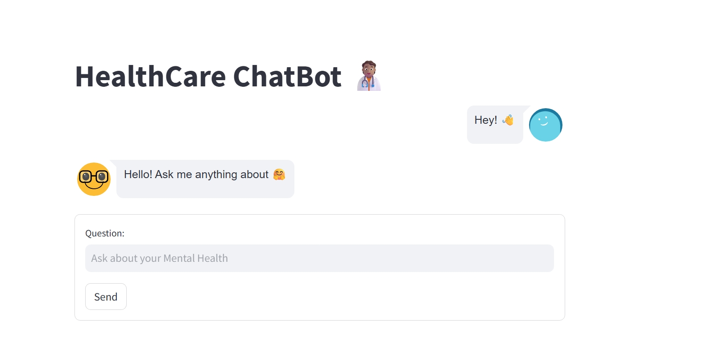

# MentalWellnessChatbot

## Description
AI chatbot designed to provide mental health advice. Built using Streamlit and LangChain, it leverages the OpenAI GPT-3.5 Turbo model via API (no large downloads required). The chatbot can retrieve information from PDF documents to offer real-time, context-aware advice to users.



## Features
- **Real-time Conversations**: Engage in interactive conversations about mental well-being.
- **Document Retrieval**: Extracts relevant information from PDF documents to provide accurate responses.
- **Powered by OpenAI API**: Uses the advanced GPT-3.5 Turbo model for generating responses (cloud-based, lightweight).

## Installation & Setup
1. Clone the repository:
   ```bash
   git clone https://github.com/Abhaykush584/Mental-Wellness-ChatBot.git
   cd MentalWellnessChatbot
   ```

2. Install the required packages:
   ```bash
   pip install -r requirements.txt
   ```

3. Set your OpenAI API key:
   - Get your API key from [OpenAI](https://platform.openai.com/).
   - Add your API key in `app.py` as instructed in the code.

4. Run the Streamlit app:
   ```bash
   streamlit run app.py
   ```

## Usage
Type your mental health-related questions or concerns, and the chatbot will provide relevant advice and information using both AI and your uploaded documents.

## Contributions
Contributions are welcome! Please create an issue or submit a pull request.

## License
This project is open-source and available under the [MIT License](LICENSE).